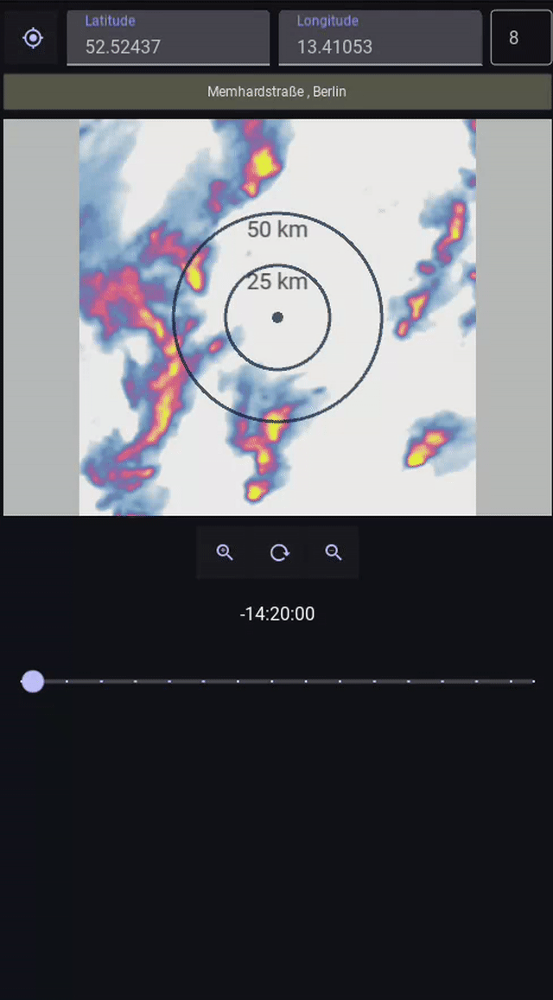

# Raincaster

Raincaster is a mobile application built with Kivy and KivyMD for weather forecasting and
rain prediction.



[Debug APK](https://drive.google.com/file/d/1Ty8BwSFkTP-wsREUnCLdG-clqsdrczP_/view?usp=sharing)

## Features

- Rain radar map
- Modern UI with KivyMD

## Installation

1. **Install dependencies:**
   - Ensure you have Python 3.11+ installed.
   - Install project:
     ```bash
     pip install ."[dev,android]"
     ```


2. **(Optional) Set up Android SDK/NDK:**
   - Follow [Kivy's Android packaging guide](https://kivy.org/doc/stable/guide/packaging-android.html#packaging-android) if building for Android.

## Build & Run Commands

- **List connected Android devices:**
  ```bash
  adb devices
  ```

- **Clean previous builds:**
  ```bash
  buildozer appclean
  buildozer -v android clean
  ```

- **Build, deploy, and run (debug):**
  ```bash
  buildozer android debug deploy run logcat
  buildozer android debug deploy run
  ```

- **Build release:**
  ```bash
  BUILDOZER_ALLOW_ORG_TEST_DOMAIN=1 buildozer android release
  ```

## Resources

- [Kivy Android Packaging Guide](https://kivy.org/doc/stable/guide/packaging-android.html#packaging-android)
- [KivyMD DropDownMenu Documentation](https://github.com/kivymd/KivyMD/wiki/Components-DropDownMenu)
